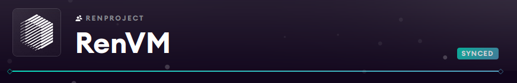

### RenVM Subgraph

Currently deployed at
* Mainnet: https://thegraph.com/explorer/subgraph/renproject/renvm
* Testnet: https://thegraph.com/explorer/subgraph/renproject/renvm-testnet

## Examples

### Send a QUERY with cURL:

Shell command:

```sh
curl \
  -X POST \
  -H "Content-Type: application/json" \
  --data '{ "query": "{ transactions { id, amount } }" }' \
  https://api.thegraph.com/subgraphs/name/renproject/renvm
```

### Get daily BTC volume

GraphQL query:

```graphql
query get24HourVolume {
    periodDatas(where: {type: HOUR }, orderBy: date, orderDirection: desc, first: 24) {
    id
    type
    date
    totalTxCountBTC
    totalLockedBTC
    totalVolumeBTC
    periodTxCountBTC
    periodVolumeBTC
    periodLockedBTC
  }
}
```

## Developing locally

To setup the graph node, follow the instructions at <https://thegraph.com/docs/quick-start>.

Some things to note:
1. Pass `-d` to `ganache-cli` so generate contracts with the same addresses as `config/ganache.json`.
2. If you restart `ganache-cli`, you may have to run `sudo rm -r data/postgres` in the `graph-node/docker` directory.

Once everything is set-up, restarting will look like:

```sh
# In darknode-sol
yarn
yarn ganache-cli -h 0.0.0.0 -d
# In a different terminal
yarn truffle migrate

# In graph-node
cd docker
sudo rm -rf data/postgres
./setup.sh # (may have to update docker-compose.yml manually, replace ethereum address with `host.docker.internal` or correct IP)
docker-compose up

# In renvm-subgraph
yarn
yarn create:local
yarn deploy:local
```

## Deploying to thegraph.com

Authorize, using the AUTH_CODE found in your thegraph.com account:

```sh
graph auth https://api.thegraph.com/deploy/ <AUTH_CODE>
```

Then run one of:

```sh
yarn deploy:mainnet
yarn deploy:chaosnet
yarn deploy:testnet
yarn deploy:devnet
```

Note: only run one deployment at a time, as they all have to generate `./src/_config.ts` with values specific to the network.
